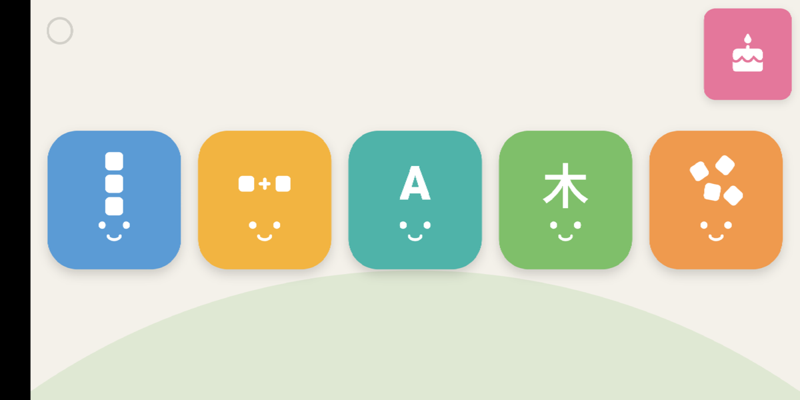
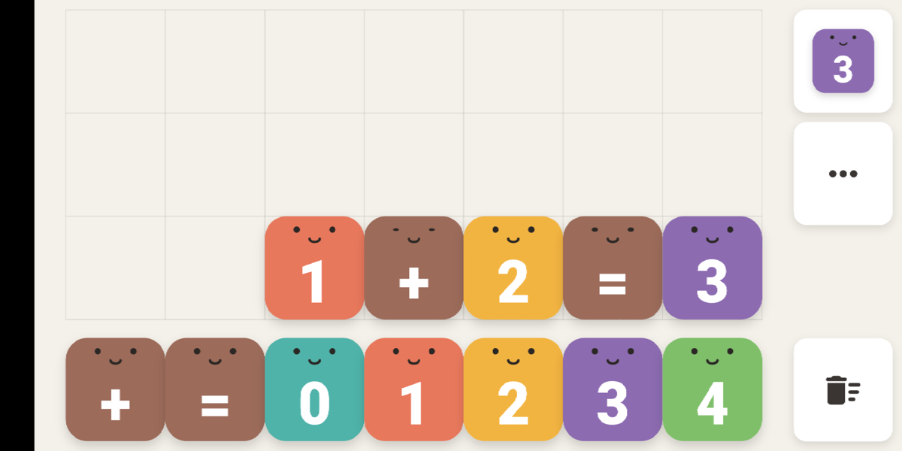
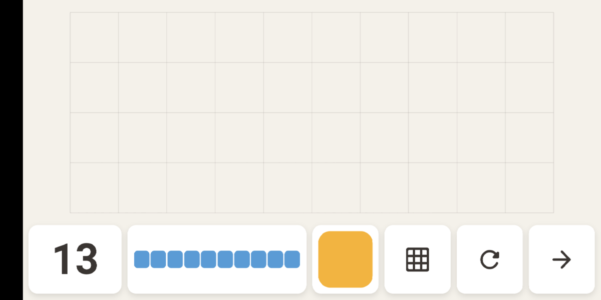
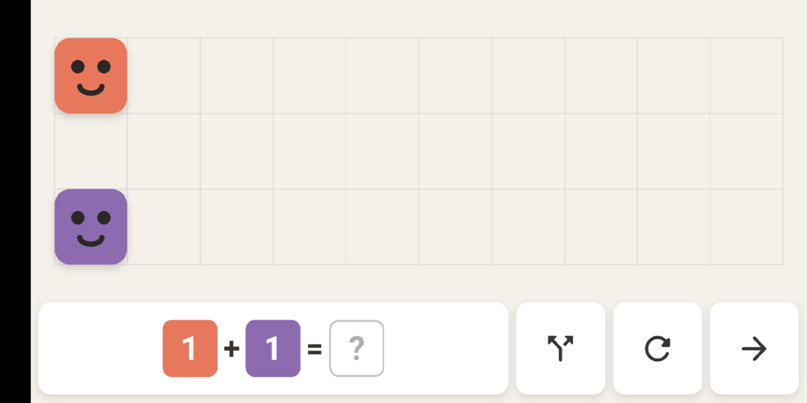
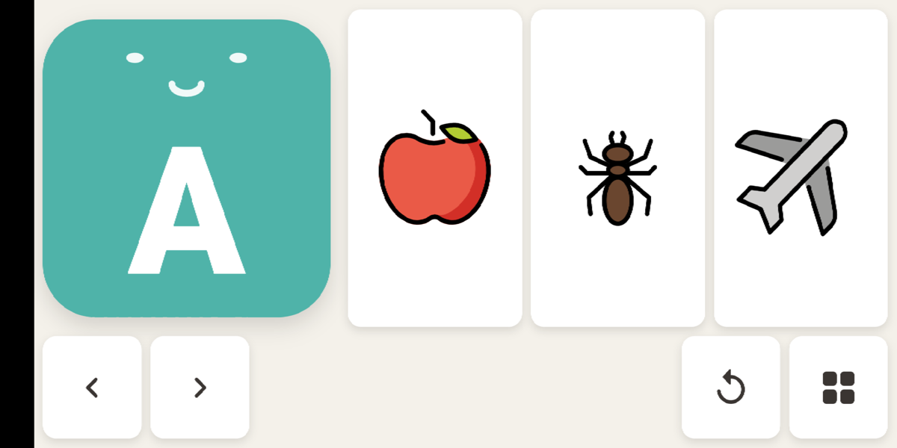
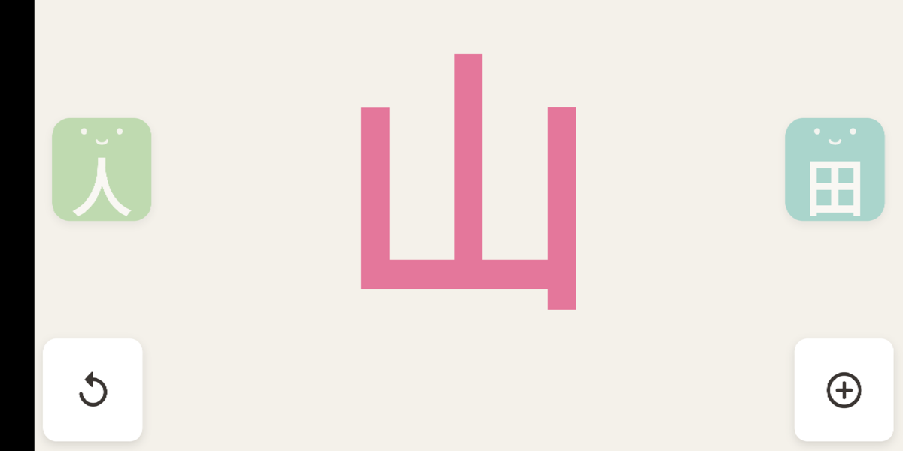
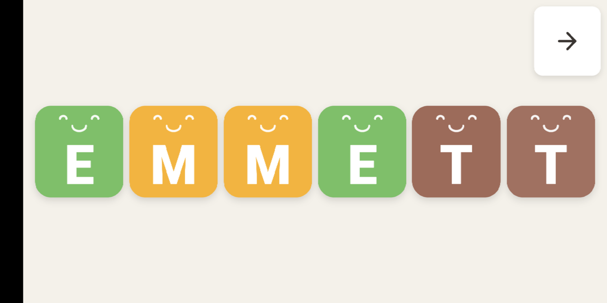
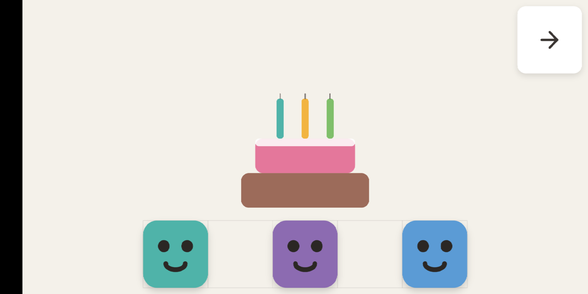

# 方块星球 · Block Planet

[中文](#中文) · [English](#english)

一款给快满三岁的孩子做的积木学习 App。离线、无广告、无内购、不收集任何数据。

An offline block-play learning app built for a nearly-three-year-old. No ads, no purchases, no data collection.

---

<a name="中文"></a>

## 中文

### 这是什么

一个生日礼物。孩子当时最着迷的事情是边看动画边用实体积木拼字母、数字、加法等式和汉字，所以这个 App 的内核不是「五个小游戏拼盘」，而是**一套积木交互语法跑通五个内容域**——他在数字模块学会的拖拽、吸附、合体动作，走进汉字模块不需要重新学。

这五类内容看起来分散，其实共享同一个心智模型：**组合**。

```
3 + 2 = 5        C + A + T = CAT
木 + 木 = 林      日 + 月 = 明
```

### 截图

以下均为 **MI 8 SE 真机 release 构建**的实拍（横屏 738×393 dp）。

| 星球地图（首页） | 自由沙盒 |
|---|---|
|  |  |
| 五块大陆 = 五个模块入口，纯图形无文字。左上角那个浅浅的圆环是家长门 | 无关卡无对错。他自己摆出 `1+2=3`，App 认出来并念给他听 |

| 数字大陆 · 位值 | 加法大陆 · 等式槽 |
|---|---|
|  |  |
| 用十条和单块拼出 13，不是数到 13 | `1 + 2 = ?`，积木区随时可以当算盘用 |

| 字母大陆 · A is for Apple | 汉字大陆 · 部件加法 |
|---|---|
|  |  |
| Apple / Ant / Airplane **都是正确答案**，点哪个都欢呼 | 人 + 田 摆到一起会合成新字；中间是象形动画 |

| 生日彩蛋 · 拼名字 | 生日彩蛋 · 蜡烛 |
|---|---|
|  |  |
| 名字来自内容包，字母左右交替飞入、逐个念出 | 三块合体成 3 点燃蜡烛，对着麦克风吹灭（点一下也行） |

<details>
<summary>家长区（长按左上角 3 秒 + 两位数乘法之后）</summary>


**这是整个 App 里唯一有文字的地方。**

</details>

### 五块大陆

| 模块 | 玩法 |
|---|---|
| 数字大陆 | 数数、**位值**（`23 = 十条 + 十条 + 3 块`）、百格板 |
| 加法大陆 | 合体、**反向分解**（把 `5` 切开 → `1+4 / 2+3 / 4+1`）、等式槽 |
| 字母大陆 | A is for Apple（可交互）、轮廓填充、大小写配对、拼自己的名字 |
| 汉字大陆 | 象形动画、**部件加法**（`木+木=林`）、反义词跷跷板 |
| 自由沙盒 | 无关卡、无对错。决定这个 App 能玩两周还是两年的模块 |

另有**生日彩蛋**：姓名字母逐个飞入 → 三块积木合体成 3 点燃三根蜡烛 → 对着麦克风吹灭（吹不灭时点一下也行）。首启自动放一次，之后从首页那块蛋糕重播。

### 三岁交互红线

这些不是建议，是写进 `lib/core/design/` 并由测试守着的硬约束。

| 约束 | 实现 |
|---|---|
| 不识字 | **儿童端零文字**。所有指令 = 语音 + 动画演示 |
| 手指精度低 | 可抓取目标 ≥ 90dp（绝对值，不随屏幕缩放）；吸附半径 = 目标 × 1.5 |
| 双通道操作 | 每个拖拽任务同时支持「点两下完成」——拖不动不等于做不到 |
| 无挫败 | 无倒计时、无分数、无生命值、**无红叉**。摆错就演示结果是什么 |
| 触摸必有回应 | 每次点击：挤压回弹 + 眨眼 + 音效，无一例外 |
| 时长 | 默认 15 分钟后积木「困了」，温柔谢幕动画，不是硬锁屏 |

### 隐私与合规

**不申请网络权限。** 没有第三方 SDK、没有分析、没有广告、没有埋点，儿童端与家长区都没有任何跳出应用的入口。麦克风只用于家长录音和吹蜡烛，音频只留在本机。

这些承诺写在 `test/compliance_test.dart` 里而不是文档里——文档第二天就可能失效，加一个依赖、粘一行 `launchUrl` 就破了，而没有任何东西会提醒你。放进用例，破坏它的那次提交会直接变红。

### 真人语音覆盖层

打底是 TTS 预生成的 617 条语音 WAV（另有 6 个音效，同样是脚本生成的）。家长可以在家长区逐条录制真人语音，写入应用文档目录，**录完立即生效，不用重新打包**：

```
文档目录/voice_overrides/<key>.wav   // 家长录音，优先
assets/audio/<key>.wav               // TTS 打底
```

优先录的是家人称谓、孩子的名字、鼓励语和生日台词——「爸爸」该是妈妈的声音，「妈妈」该是爸爸的声音，他会立刻听出来那是谁在叫谁。

### 内容包

内容与代码分离。明年他四岁，丢一个 `hanzi_l2.json` 进 `assets/packs/` 就能升级，**不改一行 Dart**。

| 文件 | 内容 |
|---|---|
| `numbers.json` | 101 个数字 |
| `letters.json` | 26 个字母 + 3 个拼字目标 |
| `hanzi.json` | 148 个汉字 + 70 组反义词 |
| `nouns.json` / `family.json` | 78 个名词 + 12 个家人称谓 |
| `phrases.json` | 11 句鼓励语与生日台词 |

### 技术选型

Flutter 3.44.8（fvm 锁定）· Dart ^3.12.2

`flutter_riverpod` · `flutter_soloud`（多个短音效并发时延迟远低于 audioplayers，「触摸必有回应」全靠它）· `record`（录音 + 吹气 PCM 流）· `shared_preferences` · `path_provider` · `wakelock_plus` · `flutter_svg`

**刻意不引入**：游戏引擎与物理引擎（幼儿要的是「吸附到位」的确定感，不是自由落体）、Rive / Lottie（积木的脸用 `CustomPainter` 程序化绘制）、任何网络 / 分析 / 广告 SDK。

积木、脸、蛋糕、星球、**连应用图标**都是 `Canvas` 画出来的，零位图素材。唯一的外部素材是 88 个 OpenMoji 名词图标。

### 目录

```
lib/
├── core/
│   ├── block/      积木引擎：模型 · 网格吸附 · 手势 · 脸 · 拼搭台
│   ├── audio/      音频总线 + 语音覆盖层解析
│   ├── content/    内容包加载与模型
│   ├── design/     颜色 / 间距 / 触控阈值
│   ├── progress/   进度与时长存档
│   └── settings/   家长设置
├── modules/        numbers · addition · letters · hanzi · sandbox · home
├── birthday/       生日彩蛋
└── parent/         家长门 · 录音 · 看板 · 设置 · 关于
tool/               gen_audio · gen_sfx · gen_icon · fetch_openmoji
```

### 开发

```bash
fvm flutter pub get
fvm flutter analyze          # 无告警
fvm flutter test             # 626 项
fvm flutter run -d <device>

fvm dart run tool/gen_audio.dart      # 内容包 → TTS 语音
fvm flutter test tool/gen_icon.dart   # 重新生成应用图标
```

平台最低版本沿用 Flutter 默认值：Android minSdk 24、iOS 13.0，两边都不需要显式配置。

### 家长区

首页**左上角**长按 3 秒，再答一道两位数乘法。

> 入口原本在右下角，真机上按不动——全屏沉浸加手势导航，屏幕底边那一条是系统的，手指落在那里先被拿去唤出导航栏。而这个入口只有 44dp、又贴着边角，几乎整个都在那条带子里。

里面有：逐条录音、中英双声道开关、每日时长上限、模块开关、今天玩了什么、隐私与素材署名。**按一下不该有反应，必须按满 3 秒**——挡的就是他乱按。

### 许可

**源代码按 [Apache License 2.0](LICENSE) 授权。** 完整条款见 `LICENSE`，第三方素材声明见 [`NOTICE`](NOTICE)。

```
Copyright 2026 eric.ding

Licensed under the Apache License, Version 2.0 (the "License");
you may not use this file except in compliance with the License.
You may obtain a copy of the License at

    http://www.apache.org/licenses/LICENSE-2.0
```

**但仓库里有两类东西不在 Apache 2.0 之下**，分发前请留意：

| 内容 | 许可 | 要点 |
|---|---|---|
| `assets/icons/` 86 个 SVG | **CC BY-SA 4.0**（OpenMoji） | 相同方式共享，**不能重新授权为 Apache 2.0**；必须保留署名 |
| `assets/audio/` 617 个 WAV | 由 macOS `say` 生成 | 用的是 Apple 系统语音，**不是本项目的原创作品**，再分发受 Apple 许可协议约束 |

音频那条是给「打算把这个 App 分发出去」的人看的：`fvm dart run tool/gen_audio.dart` 会从内容包重建全部音频，换一套授权明确的 TTS 只需改那一个脚本。

其余部分——积木、表情、蛋糕、星球、应用图标、音效——全部由代码绘制或合成，均为原创，按 Apache 2.0 授权。

### 版权

角色造型与数字—颜色对应关系均为原创。教学法（立方体表数量、位值、部件组字）属公共领域，可自由借鉴；调色板刻意避开了某部知名动画那套「色相随数字单调递增」的彩虹配色，这一条同样由 `test/compliance_test.dart` 守着。

---

<a name="english"></a>

## English

### What this is

A birthday present. The kid's favourite thing at the time was watching cartoons while building letters, numbers, addition equations and Chinese characters out of physical blocks. So this app isn't five mini-games in a trench coat — it's **one block-interaction grammar running across five content domains**. The drag, snap and merge gestures he learns in the numbers module carry over to Chinese characters unchanged.

The five domains look unrelated but share one mental model: **composition**.

```
3 + 2 = 5        C + A + T = CAT
木 + 木 = 林      日 + 月 = 明
```

### Screenshots

All shots are from a **release build on a real MI 8 SE** (landscape, 738×393 dp).

| Planet map (home) | Sandbox |
|---|---|
|  |  |
| Five continents = five modules, pure graphics, no text. The faint ring at top-left is the parent gate | No levels, no right answers. He laid out `1+2=3` himself; the app recognises it and reads it back |

| Numbers · place value | Addition · equation slots |
|---|---|
|  |  |
| Build 13 out of ten-rods and unit cubes — not count to 13 | `1 + 2 = ?`, with the block area usable as an abacus at any time |

| Letters · A is for Apple | Chinese · radical addition |
|---|---|
|  |  |
| Apple / Ant / Airplane are **all correct** — every one of them cheers | 人 + 田 merge into a new character; the centre shows the pictograph morph |

| Birthday egg · name | Birthday egg · candles |
|---|---|
|  |  |
| The name comes from a content pack; letters fly in from alternating sides, each spoken | Three blocks merge into a 3 and light the candles; blow into the mic (tapping also works) |

<details>
<summary>Parent zone (behind a 3-second hold on the top-left corner plus a two-digit multiplication)</summary>


**This is the only place in the app with any text.**

</details>

### Five continents

| Module | What you do |
|---|---|
| Numbers | Counting, **place value** (`23 = ten-rod + ten-rod + 3 units`), hundred board |
| Addition | Merging, **decomposition** (cut `5` open → `1+4 / 2+3 / 4+1`), equation slots |
| Letters | Interactive "A is for Apple", outline filling, case matching, spelling your own name |
| Chinese | Pictograph morphs, **radical addition** (`木+木=林`), antonym seesaw |
| Sandbox | No levels, no right answers. The module that decides whether this app lasts two weeks or two years |

Plus a **birthday easter egg**: the name's letters fly in one by one → three blocks merge into a 3 and light three candles → blow them out through the microphone (tapping always works too). Plays once on first launch; replayable from the cake tile on the home screen.

### Hard rules for a three-year-old

Not guidelines — constraints encoded in `lib/core/design/` and guarded by tests.

| Constraint | How |
|---|---|
| Can't read | **Zero text on the child side.** Every instruction is voice + animated demo |
| Imprecise fingers | Grab targets ≥ 90dp (absolute, never scaled); snap radius = target × 1.5 |
| Two input channels | Every drag task is also completable by tapping twice — "can't drag" must not mean "can't do it" |
| No frustration | No timers, no scores, no lives, **no red X**. A wrong placement demonstrates the result instead |
| Touch always answers | Every tap: squash-and-stretch + blink + sound effect. No exceptions |
| Session length | After 15 minutes the blocks "get sleepy" — a gentle curtain-call animation, not a hard lock |

### Privacy and compliance

**No network permission is declared.** No third-party SDKs, no analytics, no ads, no telemetry, and no link that leaves the app anywhere — parent zone included. The microphone is used only for parent recordings and blowing out candles; audio never leaves the device.

These promises live in `test/compliance_test.dart` rather than in a document. A document goes stale the next day — one added dependency or one pasted `launchUrl` breaks the promise and nothing warns you. As tests, the commit that breaks them turns red.

### Real-voice override layer

The baseline is 617 pre-generated TTS voice files in WAV (plus 6 sound effects, also script-generated). Parents can record over any line from the parent zone; recordings are written to the app's documents directory and **take effect immediately, with no rebuild**:

```
<documents>/voice_overrides/<key>.wav   // parent recording, wins
assets/audio/<key>.wav                  // TTS fallback
```

Record family terms, the child's name, praise and birthday lines first — "dad" should be mum's voice and "mum" should be dad's. He recognises instantly who is calling whom.

### Content packs

Content is separated from code. Next year, drop a `hanzi_l2.json` into `assets/packs/` and the app levels up **without a line of Dart changing**.

| File | Contents |
|---|---|
| `numbers.json` | 101 numbers |
| `letters.json` | 26 letters + 3 spelling targets |
| `hanzi.json` | 148 characters + 70 antonym pairs |
| `nouns.json` / `family.json` | 78 nouns + 12 family terms |
| `phrases.json` | 11 praise and birthday lines |

### Stack

Flutter 3.44.8 (pinned via fvm) · Dart ^3.12.2

`flutter_riverpod` · `flutter_soloud` (far lower latency than audioplayers for overlapping short sounds — "touch always answers" depends on it) · `record` (recording + breath PCM stream) · `shared_preferences` · `path_provider` · `wakelock_plus` · `flutter_svg`

**Deliberately not used**: game/physics engines (a toddler wants the certainty of *snapping into place*, not free fall), Rive / Lottie (block faces are drawn programmatically with `CustomPainter`), and any network / analytics / ad SDK.

The blocks, faces, cake, planet and **even the app icon** are drawn on a `Canvas` — zero bitmap art. The only external assets are 88 OpenMoji noun icons.

### Layout

```
lib/
├── core/
│   ├── block/      Block engine: model · snap grid · gestures · faces · board
│   ├── audio/      Audio bus + voice override resolution
│   ├── content/    Content pack loading and models
│   ├── design/     Colours / spacing / touch thresholds
│   ├── progress/   Progress and session-time storage
│   └── settings/   Parent settings
├── modules/        numbers · addition · letters · hanzi · sandbox · home
├── birthday/       Birthday easter egg
└── parent/         Gate · recorder · dashboard · settings · about
tool/               gen_audio · gen_sfx · gen_icon · fetch_openmoji
```

### Development

```bash
fvm flutter pub get
fvm flutter analyze          # clean
fvm flutter test             # 626 tests
fvm flutter run -d <device>

fvm dart run tool/gen_audio.dart      # content packs → TTS voice files
fvm flutter test tool/gen_icon.dart   # regenerate the app icon
```

Platform minimums are Flutter's defaults — Android minSdk 24, iOS 13.0 — neither needs explicit configuration.

### Parent zone

Press and hold the **top-left** corner of the home screen for 3 seconds, then answer a two-digit multiplication.

> The entry point used to be bottom-right and was unpressable on a real device: with immersive full-screen plus gesture navigation, the bottom edge belongs to the system — a finger landing there is taken to reveal the nav bar first. The entry is only 44dp and hugged the corner, so almost all of it sat inside that band.

Inside: per-line recording, bilingual toggle, daily time limit, module switches, today's activity, privacy and asset attribution. **A single tap is meant to do nothing** — the full 3-second hold is exactly what keeps the toddler out.

### License

**The source code is licensed under the [Apache License 2.0](LICENSE).** Full terms are in `LICENSE`; third-party asset terms are in [`NOTICE`](NOTICE).

```
Copyright 2026 eric.ding

Licensed under the Apache License, Version 2.0 (the "License");
you may not use this file except in compliance with the License.
You may obtain a copy of the License at

    http://www.apache.org/licenses/LICENSE-2.0
```

**Two categories of bundled content are NOT under Apache 2.0.** Check them before redistributing:

| Content | License | What it means |
|---|---|---|
| `assets/icons/` — 86 SVGs | **CC BY-SA 4.0** (OpenMoji) | Share-alike; **cannot be relicensed under Apache 2.0**. Attribution must be preserved |
| `assets/audio/` — 617 WAVs | Generated by macOS `say` | Uses Apple's system voices — **not original work of this project**. Redistribution is governed by Apple's license agreement |

That audio note matters to anyone planning to distribute this app: `fvm dart run tool/gen_audio.dart` rebuilds every file from the content packs, so switching to a clearly-licensed TTS engine only means editing that one script.

Everything else — blocks, faces, cake, planet, app icon, sound effects — is drawn or synthesised in code, is original, and is covered by Apache 2.0.

### Copyright

Character shapes and the number-to-colour mapping are original. The pedagogy (cubes for quantity, place value, radical composition) is public domain and freely borrowed. The palette deliberately avoids the "hue increasing monotonically with number" rainbow scheme of a well-known animated series — a property also guarded by `test/compliance_test.dart`.
